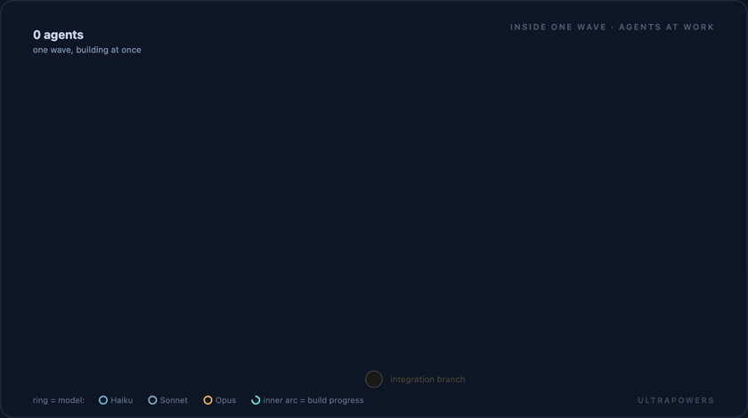
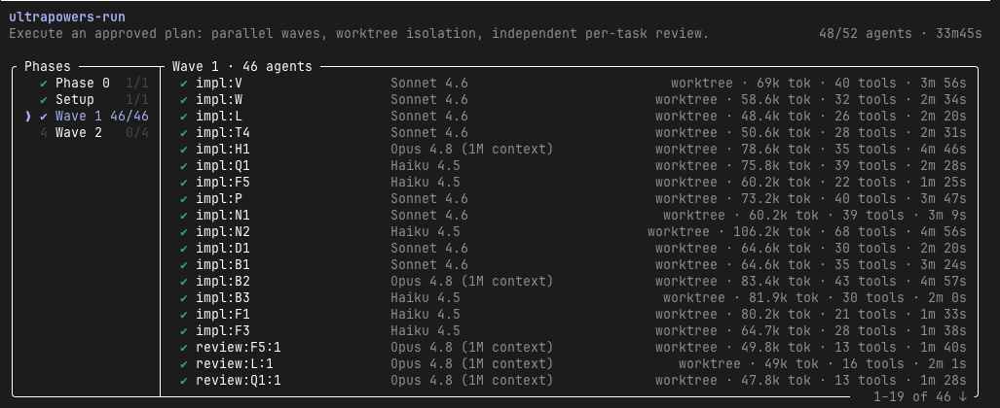

```
_  _ _    ___ ____ ____ ___  ____ _ _ _ ____ ____ ____
|  | |     |  |__/ |__| |__] |  | | | | |___ |__/ [__
|__| |___  |  |  \ |  | |    |__| |_|_| |___ |  \ ___]
```

**Give your Superpowers Ultrapowers.**

Ultrapowers is an extension to [superpowers](https://github.com/obra/superpowers), the popular agent skill for a disciplined build workflow. Use ultrapowers to hand Claude Code a big, ambitious plan and get back finished, reviewed work — without paying frontier-model prices to build every line, and without reviewing code you'd rather not read.

## Ambition is expensive

Have you ever asked Claude to do ambitious work and blown through your five-hour token budget before it
finished? (If you haven't, you're not trying hard enough;)

Smarter models invite bigger asks. "Product people" love this. You can finally think at the scale
of the whole feature, the whole idea, the whole business, instead of the next function. But pointing a frontier model
at a huge body of work and saying "build it" is the most expensive way to get it done. The premium
model writes every line, reviews itself, and drags one ever-growing transcript the whole way. You
watch your usage drain, and the work still isn't finished.

## Spend your best model where it counts

ultrapowers makes ambition affordable by using your expensive model only where it changes the
outcome.

- **Your best model plans.** It thinks hard, once, and writes a detailed plan — exact steps, often
  the actual code.
- **Cheaper models build.** A plan that complete makes each task closer to transcription than
  invention, so a cheaper model does it well.
- **Your best model checks the work.** Quality is the one place it never cuts corners.
- **Each task stays out of your main session.** You don't re-pay for one giant, ballooning
  transcript.
- **It won't over-spend.** If a plan won't benefit from the heavy parallel machinery, ultrapowers
  tells you to use a lighter tool instead.

Honest caveat: the parallel-and-review machinery *can* cost more than a plain sequential run — it's
running extra reviewers and isolated build environments. What it saves you from is what you'd reach
for otherwise: asking one frontier model to build the whole thing directly. Against that, the
savings are real. ultrapowers isn't "cheap" — it's disciplined. It refuses to waste your tokens.

## What you get

**1. Affordable ambition.** You don't pay frontier prices to write boilerplate. Your best model
plans and checks; cheaper models do the building in between.

**2. Quality you don't have to babysit.** Every task is checked by a separate reviewer before it
counts — so you don't have to read the code yourself. High-stakes work can also be held to an exam
written from your spec that the builder never sees and can't game. You make one approval at the
end, on the finished result, instead of signing off on code you can't (or don't want to) judge.

**3. Faster finishes.** (Sometimes.) When the plan allows, independent work runs at the same time instead of one
piece after another, so big work lands sooner. That's the cherry, not the headline.

## New to Superpowers?

[Superpowers](https://github.com/obra/superpowers) is a popular Claude Code skill that gives Claude a disciplined way to build software:
brainstorm the idea, write a plan, execute it, review it. It's excellent — but it builds one task
at a time, and it keeps you in the loop the whole way.

ultrapowers plugs into that workflow at the "execution plan" and "execute the plan" step. You still brainstorm and write the spec with Superpowers. ultrapowers takes the approved plan from there and runs it for you. Same discipline,
less babysitting.

## What it adds to Superpowers

- **It recommends the right tool for the job — even when that's not ultrapowers.** Hand it a plan
  and it sizes up the work. If plain Superpowers would do the job better, it says so. Honesty is a
  feature.
- **It shapes plans to run side by side.** When you plan with it, it structures the work so
  independent pieces can run at once later.
- **It runs the build between two checkpoints, not twenty.** You approve the plan. It does the work.
  You approve the finished result. No signing off on every step in between.

## When to use it — and when not

Reach for ultrapowers on big, ambitious plans with independent pieces — the kind where parallel
work and independent review pay off.

Skip it for small or tightly-connected plans, where the work has to happen in order anyway. There,
plain Superpowers is the better tool — and ultrapowers will tell you so rather than spin up
machinery you don't need.

## How it works

ultrapowers is built on **Dynamic Workflows** — a capability Claude Code added to its own runtime,
where a single script fans a job out across many subagents at once (up to sixteen), each working in
isolation, while their intermediate work stays out of your main session.
([Claude Code's docs explain the feature →](https://code.claude.com/docs/en/workflows)) This whole
project started as an experiment with that new native machinery: *what happens if you point it at a
real, approved plan?*

The clearest way to see what it does is to zoom in — the whole plan, then one task, then a single
agent.

### The whole plan, at a distance

Here's a question that sounds simple and isn't: in any plan, which work has to happen in order — and
which doesn't?

We do things one after another out of habit, and because a single worker can only hold one task at a
time. But most of that sequence is an illusion. You can't paint a wall before it's built; that order
is real, forced by the work itself. Two *different* walls, though? Two crews raise them at the same
time, and nothing in the world objects. The only thing that genuinely makes one task wait for another
is **dependency** — one task needing something another produces. Everything else only looks sequential
because we're used to one pair of hands.

Take away the false order and you're left with the real skeleton of the job: a web of *this must come
before that*. It's smaller than the to-do list makes it look. And it has an exact shape.

That shape has a name — a **directed acyclic graph**. *Directed*, because every arrow points from a
task to the task that depends on it. *Acyclic*, because nothing can depend on itself, even the long way
around a loop; if it could, the work could never start. Draw each "must-come-before" as an arrow and
your plan stops being a list and becomes a map. Tasks with no path between them can run side by side.
The depth of the graph is how long the work really takes; its width is how much can happen at once.

<p align="center">
  
</p>

ultrapowers reads your approved plan and builds exactly this graph — one starting point, fanning out
into independent work and back into a single result — then cuts the middle into **waves**: each wave a
set of tasks with nothing left to wait for, launched together. Three tasks that don't touch each other
run as three agents at once; a task that needs them waits one wave and starts the moment they land.
(It's the same picture the swarm viewer draws live as a run unfolds.)

### Zoom in: one task's life

Pick any one of those circles. Up close, it isn't a dot — it's a task with a life of its own.

<p align="center">
  
</p>

It **forks its own git worktree** — a second, complete checkout of the repository that shares its
history, a private workshop cut from the same cloth. That's the quiet corner of git that makes the
whole thing safe: a dozen agents build "the same project" at once without ever fighting over a file on
disk. One agent builds the task there, commit by commit. Then an **independent review** checks the
result against *exactly the point it forked from* — not the latest state of everything — so it can't
mistake another wave's work for this task's. For high-stakes work there's also a **sealed exam**: an
acceptance test written from your spec and locked away before the build starts, that the agent never
sees — pass or fail by its exit code, nothing to spin. You can't game a test you can't read. If the
review asks for a fix, the task loops until it passes, then **merges back** onto the one integration
branch.

### Zoom in again: the agents at work

Now watch a wave run. Every node in the graph becomes a live agent, building its task in its own
worktree — and a single wave fans out to *forty-six of them at once*:

<p align="center">
  
</p>

Each ring's colour is the model that agent runs on: the builders are Haiku and Sonnet, the reviewers
Opus. That's the whole idea in one picture — cheap models do the building, your best model does the
judging — multiplied across dozens of agents at the same time.

And this is exactly what it looks like running in Claude Code:

<p align="center">
  
</p>

### It doesn't improvise

The script that orchestrates all of this is committed and frozen; it never writes a fresh version of
itself at runtime. Same plan in, same structure out. And before every real run a tiny probe checks the
engine still behaves — so if Claude Code's workflow feature ever shifts underneath us, the run steps
down to plain sequential execution instead of breaking in the middle.

None of it this is magic, exactly. It's all premised on a handful of older, sturdy ideas —
dependency graphs, git worktrees, sealed tests — wired onto a new runtime, each doing one small job
well. 

## Get started

Install it from inside Claude Code:

```
/plugin marketplace add popmechanic/ultrapowers
/plugin install ultrapowers@ultrapowers
```

**Superpowers is required.** Install it alongside ultrapowers — ultrapowers hands the brainstorming,
planning, and wrap-up back to Superpowers' own skills.

**Where it runs.** ultrapowers runs on Claude Code's Workflows feature, available on every paid plan, across the CLI, Desktop app, IDE extensions, and SDK. On Claude Code for the web, where Workflows isn't available, it falls back to running your plan one task at a time — same plan, same result, just sequential.

**Go deeper.** The full mechanics — how plans become parallel work, how reviews are anchored, how
the engine handles failure — live in [`skills/ultrapowers/SKILL.md`](skills/ultrapowers/SKILL.md)
and [`skills/ultrapowers/references/`](skills/ultrapowers/references/).
